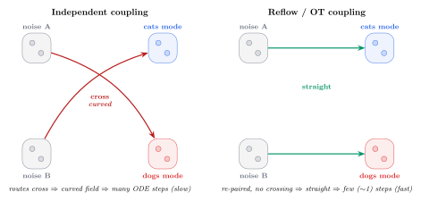

# Day 1 — July 20, 2026

_Notes from the first day of the DL4SCI 2026 Summer School._

## Sessions

### Denoising Diffusion Models — Arash Vahdat (Nvidia)

- Speaker: **Arash Vahdat** (confirmed live). A central researcher in denoising diffusion
  (NVAE, LSGM, Denoising Diffusion GANs; co-author of the CVPR diffusion tutorial).
- Anecdote: he joked that his **cat is more famous than he is**, because he uses it a lot
  as the example image to illustrate the diffusion *forward process*.

#### Challenges: modeling weather with vision tools

Modeling weather with generative vision models is **very different** from generating videos
of natural images (e.g. a cat). Key differences:

- **Different nature of the data** ("different characters"): these are not natural images.
- **Different dynamic range per variable** — each physical variable (temperature, pressure,
  wind, humidity, etc.) has its own scale and range.
- **Different correlations across channels** — the channels (variables) are correlated in a
  physical / non-trivial way, unlike the RGB channels of a natural image.

#### Extreme weather events

- **Reliable forecasting of extreme weather events** requires generative models that can
  model the **extreme and rare data points** well (the tails of the distribution).
- Most days are "boring": temperatures close to the **norm / mean**. But the cases that
  matter are the **uncommon** ones: temperature spikes, heat waves, outlier events.
- Challenge: models tend to fit the center of the distribution well, but what's critical
  here is capturing the **tails** (rare, high-impact events).

### Scaling Laws in LLMs — _(speaker TBD)_

- Making the **architecture bigger does not necessarily improve results** — more
  parameters alone is not guaranteed to give better performance.
- There are **three scaling laws / regimes**:
  1. **Pre-training scaling law**
  2. **Post-training scaling law**
  3. **Test-time (inference) scaling law**
- Limitations / challenges:
  - **Limited observation** (limited data points to fit the law).
  - **Data limitation** (not enough data).
  - **Train / eval mismatch** (training objective vs. evaluation don't line up).
  - **Domain-specific limitations**.

#### Problem definition — generative approach for design

- **Objective:** `max_{x ∈ F}  R(x; c)`
  - `x` — a candidate design; `F` — the feasible set (e.g. valid molecules / designable proteins).
  - `R(x; c)` — reward function, conditioned on `c`.
- **Generative approach:** train `p(x)` on a set of **valid molecules or designable proteins**.
  - Feasibility ↔ likelihood: `x ∈ F  ⟺  x ~ p_θ(x)` (staying in the data manifold = being feasible).
- Reformulate the constrained max as sampling from an optimal distribution:
  `max_{x ∈ F} R(x; c)  →  q*(x) ∝ p_θ(x) · exp( R(x; c) / λ )`
  - Reward-tilted distribution: reweight the generative prior `p_θ(x)` by the exponentiated
    reward. `λ` is a temperature — small `λ` → sharper toward high reward; large `λ` → stays
    closer to the prior `p_θ`. _(reconstructed; confirm exact form against the slide)_
- **Three paradigms** to approach it:
  1. **Generative training** — learn `p_θ(x)` from valid data.
  2. **Post-training alignment w/ RL** — fine-tune with reinforcement learning toward the reward.
  3. **Test-time search** — search/guide at inference time (no weight updates).
- **Representation of molecules / fragments** (string-based):
  - **SMILES** — standard string notation for molecules.
  - **SAFE** — Sequential Attachment-based Fragment Embedding; fragment-based string
    representation that makes fragment-level generation easier.
- **GenMol** — fragment-based **discrete diffusion** model.
  - GenMol generates tokens/characters in **different (arbitrary) orders** — not left-to-right.
  - In contrast, **autoregressive SAFE-GPT** generates **sequentially** (fixed order,
    one token after another).
- **Molecule synthesizability**
  - Problem: existing molecular generative models … _(TODO — finish: they generate molecules
    that are hard/impossible to synthesize in the lab?)_
  - **ReaSyn** (Reaction Synthesis) — improved **synthesizability projection**.
    - Uses an **encoder–decoder transformer** to **autoregressively predict** the
      synthetic pathway (reaction route) of a given target molecule.
  - _(This was topic **#4** of the talk: ReaSyn.)_

#### Topic #5 — Proteins

- **La-Proteina** — **fully-atomistic protein design**.
  - Genuinely a **hard** problem (modeling proteins at full-atom resolution).
  - Uses an **encoder–decoder architecture**.

<!-- TODO: capture encoder/decoder details from the slide (what's encoded, latent space,
     how atoms are decoded, diffusion in latent space?, etc.) -->

#### Topic #6 — Protein Binder Design (**Complexa**)

- **Binder design** — the hard part.
  - "Bind" = to attach/dock. A **binder** is a designed protein that must **bind** to a
    specific **target** (another protein, receptor, antigen) with high **affinity** and
    **specificity**.
  - Key for drugs/therapeutics (antibodies, inhibitors): design a protein that recognizes
    and sticks to the right target.
  - Hard because you must design the **binding interface** (geometry + chemistry of the
    contacting atoms) correctly.
- **Complexa** — model/approach for **protein binder design**.

<!-- TODO: Complexa details from the slides -->

##### Concept notes — proteins, structure prediction vs binder design

**Proteins are dynamic (they move).**
- A predicted 3D structure (à la AlphaFold) is *one representative conformation* — like a
  single photo. In reality a protein **fluctuates**: it vibrates, "breathes", and lives as an
  **ensemble** of conformations.
- This matters for binding: on **induced fit**, both the binder and the target can **change
  shape** to fit better — it's not a rigid lock-and-key. Side chains and interface loops are
  flexible. So sometimes we model a **distribution** of conformations (or the dynamics), not
  a single 3D point.

**Two different problems (don't confuse them):**
1. **Structure prediction** — *"given this amino-acid sequence, what shape does it fold into?"*
   - Fundamental because a protein's **function depends on its shape**.
   - General-purpose: useful for understanding disease, enzymes, small-molecule drugs, basic
     biology — far beyond binders. (This is what AlphaFold largely solved.)
2. **Binder design** — the **inverse** problem: *"I want something that sticks to this target,
   what sequence/structure do I invent?"*

**Why 3D prediction still matters even though proteins move:**
- The predicted 3D is the **starting point / reference** — the protein fluctuates *around* it,
  it doesn't jump to random shapes.
- To design a binder you first need the **target's 3D shape** to know where and how to attach.
  Without the 3D you can't even start.
- Dynamics is a **refinement** that improves accuracy; it doesn't replace the base 3D.
- Key point: not every 3D prediction "is a binder". Structure prediction is a **general tool**;
  binder design is an **application** built on top of it.

**What is a binder for? (why design a new one)**
- In the body / a disease / a virus there's a **target** protein doing something — sometimes
  something bad. A **binder** is a new piece you design to stick to that target and **control**
  it. Uses:
  - **Block / inhibit** 🛑 — cover the active site so the harmful protein stops working
    (e.g. binders to the SARS-CoV-2 spike that block infection).
  - **Tag / flag** 🏷️ — stick to a diseased (e.g. tumor) cell so the immune system attacks it
    (how many therapeutic **antibodies** work).
  - **Detect** 🔬 — a binder that only sticks to one molecule → a sensor / diagnostic test.
  - **Deliver** 📦 — bind only to diseased cells and carry a drug precisely there.
- **Why design new ones instead of reusing existing ones:** nature doesn't have a binder for
  every target we care about; many disease targets have **no** treatment because nothing is
  known to stick to them. Lab screening (testing millions) is **slow and expensive**. Generative
  AI (e.g. Complexa) can **design a custom binder from scratch** for a specific target — much
  faster and cheaper. That's the payoff.
- **Analogy:** the target is a **lock**; the binder is a **custom-made key** that jams (or opens)
  it. There's no ready-made key for every lock → you must **fabricate** the new key. That is
  binder design.

##### Large-scale wet lab validation campaign

- Designs from the model are validated **in the real lab** ("wet lab"), not just in silico.
- Done at **large scale** — many designed binders synthesized and experimentally tested to
  measure whether they actually bind (affinity, success rate, etc.).

<!-- TODO: numbers from the slide — how many designs tested, success/hit rate, targets -->

##### Q&A

- Q: a **t-distribution** might not be great for capturing the **tails** (extreme/rare events).
- A: the speaker acknowledged it — said it's **ongoing work** they're currently doing.
  - (Ties back to the earlier point: reliably modeling the **tails** of the distribution is
    the hard, open part.)

### Accelerated Diffusion Models — Julius Berner (Nvidia)

#### Section 1 — General diffusion and flow models

- Basically the theory of **flow matching**:
  - **Interpolation** — define a path `x_t` between data `x_1` (or `x_0`) and noise, e.g. a
    linear interpolation `x_t = (1 - t) x_0 + t x_1`.
  - **Velocity field** — the model learns a velocity (vector) field `v_θ(x_t, t)` that tells
    each point which direction/speed to move along the path.
  - Generation = integrate an ODE following that velocity field to flow noise → data.
- **Example — generation time for video diffusion models** (motivates "acceleration"):
  - **Trade-off:** while achieving impressive results, **video diffusion models take several
    minutes to generate a short clip** → too slow. This is the bottleneck the talk is about.
- **Background on architectures — Diffusion Transformer (DiT)** acting on **pixel patches**:
  - Prevalent architecture: **DiT** with **non-overlapping patches as tokens** and **adaptive
    layer norm (adaLN)** for **time-conditioning**.
  - **Benefit:** great performance and scaling.
  - **Cost:** attention **scales quadratically in the number of tokens**, which **grows rapidly
    with resolution** → expensive at high resolution / long video.
- **Dimensionality reduction** — model the data in a **latent space** (not raw pixels):
  - **Latent diffusion:** map data → a **compressed latent space** (e.g. via a VAE), run
    diffusion there → far fewer tokens → cheaper/faster, tackles the quadratic-cost problem.
- **Efficient architectures** — adapt or replace self-attention to exploit **sparsity**:
  - **Sparsity:** attention scores typically show **high sparsity** (however, it is
    model-conditioned and **layer/head-dependent**).
  - **Sub-quadratic cost:** sparse, **local**, or **linear attention**, and **state-space
    models** (SSMs).
  - **Hybrid architectures:** combine **attention (global)** with **convolutional layers
    (local)**.
- **General acceleration methods — model compression and hardware / inference optimization:**
  - **Hardware optimization:** kernel fusion, graph compilation, **FlashAttention**.
  - **Precision reduction:** **quantization** (lower-bit weights/activations).
  - Example: **FLUX.2-dev inference speedup** (case study of the above applied). _(TODO:
    speedup numbers from the slide)_
- **Improved numerical solvers** (fewer / better ODE steps):
  - Levers: **adaptivity, order, history, reparametrizations**, and more.
  - **Time-discretization:** adaptive or **learned** (instead of fixed uniform steps).
- **Trajectory design** — shape the generative path to make it easier/faster to integrate:
  - Depends on the **data/prior distribution**, the **coupling** (how noise is paired with
    data), and the **interpolant** (the chosen path `x_t`).
  - **Ingredients influencing ODE trajectories:**
    - **Data/prior distribution:** use a latent space with better **"diffusibility"** — e.g.
      **replace the VAE by a representation encoder** (a latent that's easier/straighter to
      diffuse through). _(said "BAE" → likely VAE)_
    - **Coupling** — how to pair `(x0, xt)` (noise ↔ data):
      - **mini-batch optimal transport** (OT re-pairing within a batch),
      - use a **pre-trained flow (reflow / rectified flow)**, or
      - **learn `p(xt | x0)`**.
    - **Interpolant** — make it **learnable** (depends on `x0, xt`) with a **straightness
      objective** (paths as straight as possible → fewer ODE steps).

##### Concept — why the coupling diagram has crossing lines (and what reflow does)

- Setup: left column = starting points `x0` (noise), shown as **two clusters** (top + bottom);
  right column = targets `xt` (data), also **two clusters**. Lines connect each `x0` to its
  paired `xt`.
- **Independent (random) coupling:** you pair a noise point with a *random* data point. So a
  top-`x0` may go to a **bottom-`xt`** and a bottom-`x0` to a **top-`xt`** → the lines
  **cross**. Crossing pairings force the learned velocity field to *average* over conflicting
  directions at the crossing point → **curved trajectories** → need **many ODE steps**.
- **OT / reflow coupling:** re-pair the points so lines **don't cross** (top↔top, bottom↔bottom).
  - **Reflow (rectified flow):** train a first flow, use it to transport noise→data, then
    **re-couple** each noise sample with the data point it actually flowed to, and **retrain**.
    Repeating this **straightens** the trajectories.
  - Straight, non-crossing paths ⇒ integrable in **very few steps** (even ~1) ⇒ faster sampling.
- So the crossing vs non-crossing lines in the slide illustrate: **bad coupling = curvy = slow;
  reflow/OT coupling = straight = fast.**

**Why are there two circles per side? (it's about modes, not "two errors")**
- On the **data side (`xt`)**: the two circles = **two modes of the real data distribution**,
  e.g. one blob of **cats** and one blob of **dogs**. Real data is **multi-modal**; the toy
  diagram uses just two modes so it's visible.
- On the **noise side (`x0`)**: the prior is usually a **single Gaussian** (one blob). It's
  drawn as two sub-groups only to **track which noise points get routed to which data mode** —
  it is *not* two different noise distributions.
- Independent coupling: a noise point near the top might be paired with a **dog** and its
  neighbor with a **cat** → routes to dog-mode and cat-mode **cross** → curved field → slow.
- Reflow/OT coupling: re-pair so the top noise region flows consistently to **one** mode and
  the bottom region to the **other** → **no crossing** → straight → fast.
- Takeaway: it's **one** noise distribution flowing into a **multi-modal** data distribution
  (cats + dogs); the diagram contrasts good vs bad **routing** of noise into those modes.

**Diagram** (TikZ → SVG, source: [`figs/coupling.tex`](figs/coupling.tex)):

- **Left — Independent coupling:** routes cross ⇒ curved field ⇒ many ODE steps (slow).
- **Right — Reflow / OT coupling:** re-paired, no crossing ⇒ straight ⇒ few (~1) steps (fast).

> **Clarification — crossing is NOT a wrong result, it's a *speed* problem.**
> The arrows are the **training coupling** (which noise is arbitrarily paired with which data
> during training), not "where a point ends up at inference".
> - **Both** couplings learn the **correct** distribution — with enough steps, each generates
>   valid cats and dogs. Crossing does **not** send samples to the wrong domain.
> - The model learns a **single** velocity `v(x,t)` per point/time. Where two training
>   trajectories cross, it must average conflicting directions ⇒ the marginal field becomes
>   **curved**. A curved field needs **many small ODE steps** to integrate accurately; too few
>   steps ⇒ integration error ⇒ worse samples.
> - Reflow/OT straightens the field ⇒ **same quality with far fewer steps**.
> - So your intuition is right: the real issue is the **number of steps** to reach the solution.
>   Crossing → curved → many steps (slow); straight → few steps (fast).

#### Step-distillation paradigms

- Goal: **match the teacher's trajectory or distribution in fewer steps** (distill a slow
  many-step teacher into a fast few-step student).
- **Parametrization:** `f_{s,t}(x_s) = x_s + (t − s) · v_{s,t}(x_s)`,
  where `v_{s,t}` is **initialized with the teacher**.
  - Inspired by **mean velocity**; more general parametrizations are possible.
  - **Boundary condition** `f_{t,t}(x_t) = x_t` is important for several methods.

#### Section 2 — Deep-dive into step-distillation

##### Progressive distillation

- Idea: **learn large jumps from smaller ones** (a student learns to take 1 big step that
  matches 2 teacher steps; repeat → halve the step count each round).
- **Pros:** ~3 forward passes but **no full trajectory required**.
- **Cons:**
  1. **compounding errors**,
  2. (if using a **frozen map**) **multiple iterations** needed,
  3. (otherwise) **moving target** in the loss + an **additional loss for `t = s`**
     (match the identity / boundary condition).

##### Consistency models & Eulerian flow maps

- Enforce **consistent predictions along the trajectory** — all points on a path should map to
  the same target (self-consistency), instead of learning big jumps from smaller ones.
- Objective involves the **derivative of the flow map** along the path:
  `‖ d/ds  f_{s,t}(x_s) ‖`  → penalize how much the prediction changes as `s` moves
  (Eulerian / differential view). Consistency ⇒ this stays ~0 along the trajectory.

<!-- Notes go here -->

<!-- Protein design / generative models for proteins — notes go here -->

<!-- Add notes here -->

<!-- Add lecture / tutorial notes here -->

## Key takeaways

<!-- Summarize the main points -->

## Questions & follow-ups

<!-- Things to revisit -->
